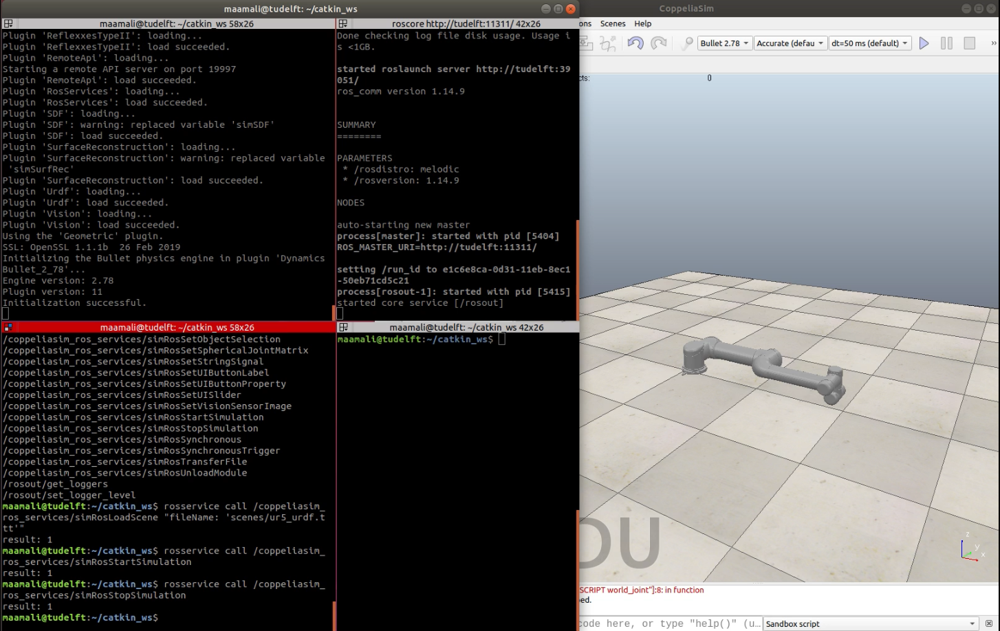

# coppeliasim_ros_services
ROS-wrappers of the [coppeliasim APIs][]. A collection of rosservices-servers/publishers implemented based on the [coppeliasim APIs][]. These service-servers/publisher use of the msgs/srvs files defined in the [coppeliasim_msgs_srvs][] package. This package enables ros to control the simulation inside coppeliasim (e.g. start/stop the simulation, loading/unloading scenes/modules, ... etc), and it allows coppelisaim to publish important information about the simulation state (e.g. clock, simulation_state, time_step, simulation_time) on a ros-topic. 

### Dependencies
- [coppeliasim_msgs_srvs][]: contains the header files of the msgs/srvs used in this package.

### Building 
The following instructions assume that a catkin workspace has been created at `$HOME/catkin_ws` and Coppeliasim directory is placed at the Home directory `$HOME/CoppeliaSim`. you always can update the paths based on your machine setup.

```bash
# change to the src directory in your Catkin workspace
cd $HOME/catkin_ws/src

# Clone coppeliasim_msgs_srvs pkg 
git clone https://github.com/mahmoud-a-ali/coppeliasim_ros_services

# change to the main Catkin workspace
cd ..

# build the workspace (using catkin_tools)
 catkin build
 
# After building, you can check if the plugin 'libsimExtRosServices.so' was successfuly created by listing the content of the devel/lib
ls devel/lib/
```

### Running
The generated plugin should be loaded while starting coppeliasim, this can be done by copying the plugin 'libsimExtRosServices.so' to the main directory of Coppeliasim `$HOME/CoppeliaSim`:
```
# Copy the generated plugin to CoppeliaSim directory
cp  $HOME/catkin_ws/devel/lib/libsimExtRosServices.so  $HOME/CoppeliaSim/
```
In a new terminal start a ros master before you start CoppelliaSim:
```
roscore
```
In a nother terminal run CoppeliaSim:
```
# change to Coppeliasim dir 
cd $HOME/CoppeliaSim

# run Coppeliasim
./coppeliaSim.sh
```
or you can launch coppeliasim using the [coppeliasim_run][] package:
```
rosrun coppeliasim_run start_coppeliasim
```

In the same terminal running Coppeliasim, you can see the following message indicating a successful loading of the `RosServices` plugin:
```
Plugin 'RosServices': loading...
Plugin 'RosServices': load succeeded.
```
In new terminal, you can check all the available services/topics publised by the plugin:
- services: all service related to the plugin will have `/coppeliasim_ros_services/` as a prefix
```
rosservice list
```
- topics: two main topics published by the plugin are `/clock` and `/info`
```
rostopic list
```

### Usage
The plugin publishes two topics (clock and info), and many services. Here is an example of how you can use some of these services:
- starting the simulation
```
# service_request is empty, service_response is an integer indicates successful operation 
 rosservice call /coppeliasim_ros_services/simRosStopSimulation
```

- Loading a module: loading the [coppeliasim_ros_control][] module (file: libsimExtRosControl.so , name:RosControl)
```
# service_request should conatins a path to module_file and module_name, service_response is an integer represents the pluginHandle /coppeliasim_ros_services/simRosLoadModule 'libsimExtRosControl.so' 'RosControl'
```

For more information about all the services, check the [coppeliasim APIs][] page.


### Example
Refer to [ur5_coppeliasim_roscontrol][] package on how you can use the `RosServices` plugin to control the simulation of a ur5_robot in coppeliasim.


### video
[](https://www.youtube.com/watch?v=t0-VEyB9-0w&ab_channel=mahmoudali)


[coppeliasim_ros_control]: https://github.com/tud-cor/coppeliasim_ros_control
[coppeliasim_run]: https://github.com/mahmoud-a-ali/coppeliasim_run
[coppeliasim_msgs_srvs]: https://github.com/mahmoud-a-ali/coppeliasim_msgs_srvs 
[coppeliasim_ros_services]: https://github.com/mahmoud-a-ali/coppeliasim_ros_services
[Coppeliasim_msgs_srvs]: https://github.com/mahmoud-a-ali/Coppeliasim_msgs_srvs
[vrep_plugin]: https://github.com/jocacace/vrep_plugin
[coppeliasim]: https://www.coppeliarobotics.com/
[ur5_coppeliasim_roscontrol]: https://github.com/tud-cor/ur5_coppeliasim_roscontrol
[simStartSimulation()]: https://www.coppeliarobotics.com/helpFiles/en/regularApi/simStartSimulation.htm
 [simLoadScene()]: https://www.coppeliarobotics.com/helpFiles/en/regularApi/simLoadScene.htm
[coppeliasim APIs]: https://www.coppeliarobotics.com/helpFiles/en/apiFunctionListCategory.htm
[vrep_common]: https://github.com/jocacace/vrep_common
[Jonathan Cacace]: http://wpage.unina.it/jonathan.cacace/
